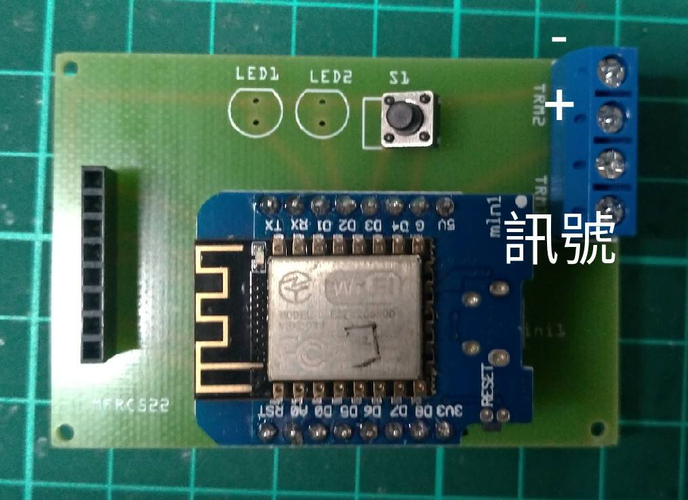

# 泰國神廟ESP程式碼

## ESP32_main：匯集板程式
---
## D1mini_RC522_AB：感應點A、B
## D1mini_RC522_door：房間門感應點
## D1mini_RC522_other：其他感應點

---
## btn_array：信箱按鍵
## wormhole_LED：蟲洞LED燈條
## SendDemo：布幕升降
    若缺乏模組就把rc-switch-2.6.4壓成ZIP加到arduino裡面，於IRF收發內
---
